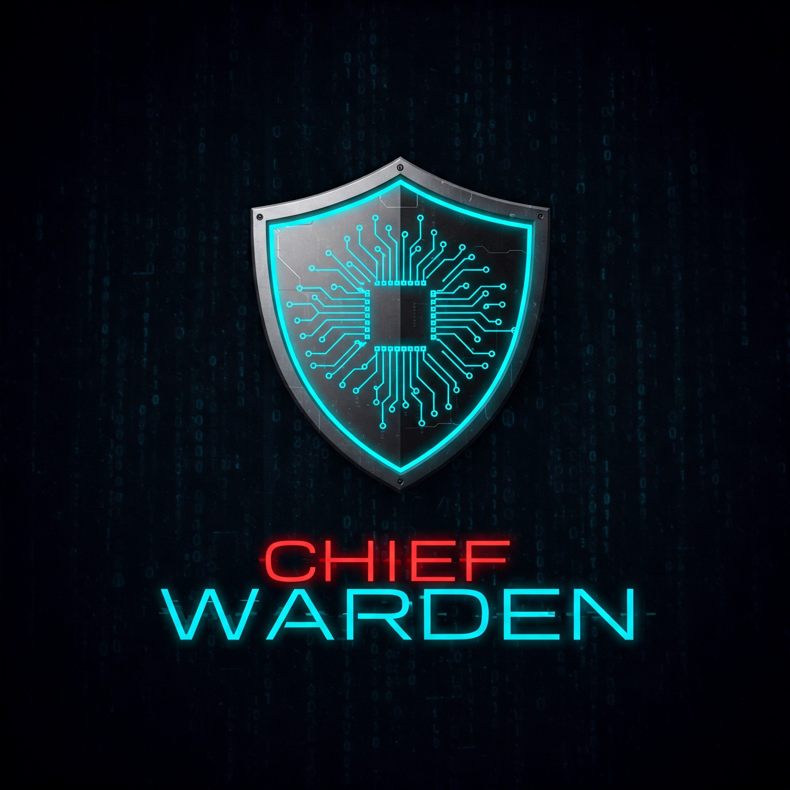

# Chief Warden
#   
## About the Project
Chief Warden is a simple CLI-based malware classification tool. This project is built by an engineering student learning digital forensics and AI, combining both fields in a practical way. It also serves as an opportunity to explore CLI tool deployment. 

This is a simple learning project

The model is inspired by **Stripe's Fraud Detection System** and applies a **Hybrid XGBoost + Neural Network** approach to classify Portable Executable (PE) files as either malware or safe based on static analysis.

---


## Technical Details
- **Model**: Hybrid XGBoost + Neural Network from static analysis
- **Risk Assessment**: Color-coded threat level classification with emoji visualization

---

## System Requirements

- **Operating System**: Windows 10/11 (Cross-platform support planned)
- **Python Version**: 3.8 or higher
- **Hardware**:
  - Minimum: 4GB RAM, 2GHz CPU
  - Recommended: CUDA-compatible GPU for neural network acceleration
- **Disk Space**: 500MB (1GB recommended for custom model training)

---

## Installation

### Quick Install (For End Users)

1. **Install Python** (if not already installed):
   - Download from [python.org](https://www.python.org/downloads/)
   - Check "Add Python to PATH" during installation

2. **Install Chief Warden**:
   ```powershell
   pip install git+https://github.com/Addy-Da-Baddy/ChiefWarden.git
   ```
3. **Verify Installation**:
   ```powershell
   ChiefWarden --version
   ```

### Developer Installation

1. **Clone the repository**:
   ```powershell
   https://github.com/Addy-Da-Baddy/ChiefWarden.git
   cd ChiefWarden
   ```

2. **Create a virtual environment**:
   ```powershell
   python -m venv venv
   venv\Scripts\activate
   ```

3. **Install dependencies**:
   ```powershell
   pip install -r requirements.txt
   python setup.py install
   ```

---

## Usage Guide

### Basic Malware Scan
```powershell
ChiefWarden --predict "C:\path\to\suspicious.exe"
```
**Sample Output:**
```
[+] Analyzing: suspicious.exe
[+] Feature extraction complete
[+] The file has an 87.34% chance of being malware.
[+] Risk Assessment: 🔴 HIGH RISK - Likely malware, avoid execution.
```

### Advanced Options

**Train Custom Models**:
```powershell
ChiefWarden --train "C:\path\to\dataset.csv" -o "C:\custom_models"
```

**Use Custom Models**:
```powershell
ChiefWarden --predictCustom "C:\custom_models" "C:\path\to\file.exe"
```

### Command Reference

| Command         | Description                    | Example                                      |
|----------------|--------------------------------|----------------------------------------------|
| `predict`       | Scan with default models      | `ChiefWarden --predict file.exe`             |
| `predictCustom` | Scan with custom models       | `ChiefWarden --predictCustom model_folder file.exe` |
| `train`        | Train new models              | `ChiefWarden --train data.csv -o output_folder` |

---

## Project Structure
```plaintext
ChiefWarden/
├── models/               # Pre-trained model files
├── src/                  # Core application code
├── requirements.txt      # Python dependencies
├── setup.py              # Installation script
└── README.md             # This document
```

---

## Limitations
- **Currently Windows-only** (PE files only)
- **Static analysis only** (no behavioral analysis)
- **Model accuracy depends on training data quality**
- **Requires Python environment setup**

---

## Roadmap

### Near-Term Objectives
- Improve model explainability using SHAP techniques
- Enhance feature extraction algorithms
- Optimize training pipeline efficiency

### Long-Term Vision
- Implement dynamic sandboxing capabilities
- Develop AI-powered forensic reporting
- Integrate Large Language Model insights
- Expand cross-platform support
- Advanced threat signature analysis

---

## Contribution

While this is primarily a learning project, contributions are welcome! Please open an issue first to discuss potential changes.


### How to Contribute
1. Fork the repository
2. Create a feature branch
3. Commit your changes
4. Push to the branch
5. Submit a pull request

### Reporting Issues
- Open GitHub issues for bug reports
- Provide detailed information about encountered problems
- Include system specifications and reproduction steps

---

## Limitations and Disclaimers
- Potential for false positive/negative classifications
- Currently limited to Windows platform
- Continuous improvement based on community feedback

---

## License
Chief Warden is released under the **Apache License 2.0**. See the LICENSE file for complete details.

---

## Contact and Support
For questions, suggestions, or collaboration opportunities, please open a GitHub issue or contact the project maintainer.

---

